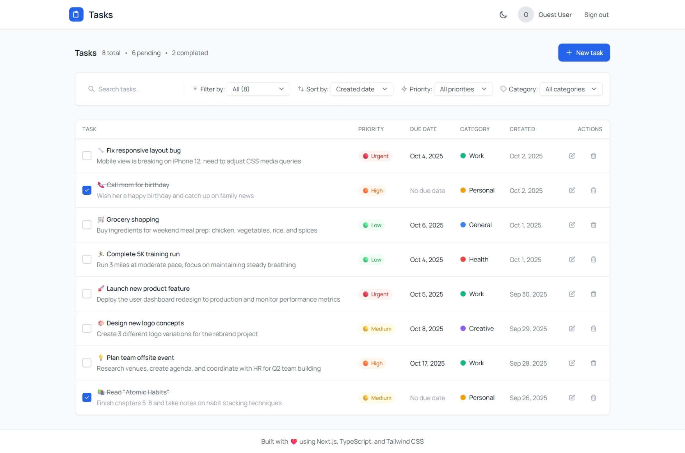
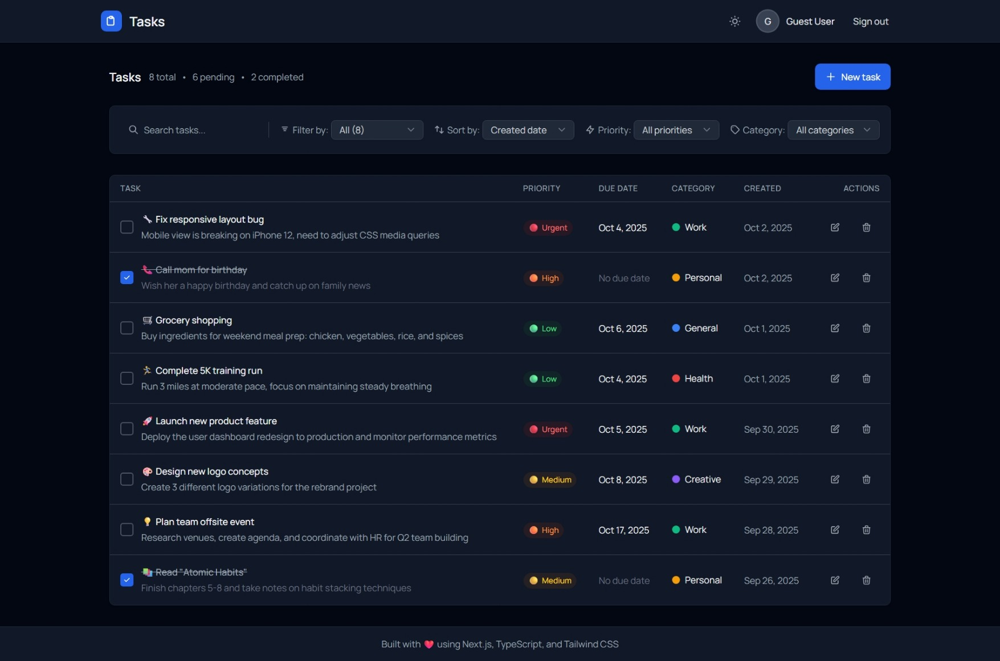

# Todo List App - Modern Task Management

A modern, production-ready todo list application built with Next.js, TypeScript, and Tailwind CSS. Features a clean Notion-style interface with advanced filtering, drag-and-drop functionality, and real-time updates.

## 🚀 Live Demo

**🌐 [View Live Demo](https://to-do-list-three-ashen-51.vercel.app/)**

## 📸 Screenshots

<div align="center">
  
  <p><em>Homepage with Light Theme - Clean Notion-style interface</em></p>
  
  
  <p><em>Homepage with Dark Theme - Elegant dark mode design</em></p>
</div>

## ✨ Features

### Core Functionality
- ✅ **CRUD Operations**: Create, read, update, and delete todos
- 🔐 **User Authentication**: Secure login and registration system
- 📱 **Responsive Design**: Works seamlessly on desktop and mobile devices
- 🎨 **Notion-style UI**: Clean, tabular interface inspired by Notion

### Advanced Features
- 🏷️ **Categories**: Organize todos with custom categories and colors
- ⚡ **Priorities**: Set priority levels (Low, Medium, High, Urgent)
- 🔍 **Smart Filtering**: Filter by status, priority, category, and search
- 📅 **Due Dates**: Set and track deadlines for your tasks
- 🔄 **Drag & Drop**: Reorder todos with intuitive drag-and-drop functionality
- 🌙 **Theme Switching**: Light and dark mode with symbol-based switcher
- 📊 **Real-time Updates**: Instant UI updates with optimistic rendering
- 🔔 **Toast Notifications**: User feedback for all actions

### Technical Features
- 🚀 **TypeScript**: Full type safety throughout the application
- ⚛️ **React Hooks**: Modern React patterns with custom hooks
- 🎯 **Performance Optimized**: React.memo, useCallback, and useMemo
- 🎨 **Tailwind CSS**: Utility-first CSS framework for rapid styling
- 📦 **Component Library**: Reusable UI components with proper accessibility
- 🛡️ **Error Boundaries**: Graceful error handling
- 🔄 **React Query**: Efficient data fetching and caching

## 🚀 Quick Start

### Prerequisites
- Node.js 18.0.0 or higher
- npm 8.0.0 or higher

### Installation

1. **Clone the repository**
   ```bash
   git clone https://github.com/HRG-OFFICIAL/To-Do-List.git
   cd To-Do-List
   ```

2. **Install dependencies**
   ```bash
   npm install
   ```

3. **Start the development server**
   ```bash
   npm run dev
   ```

4. **Open your browser**
   Navigate to [http://localhost:3000](http://localhost:3000)

### Demo Credentials
- **Email**: demo@example.com
- **Password**: password

## 📁 Project Structure

```
src/
├── app/                    # Next.js app directory
│   ├── globals.css        # Global styles
│   ├── layout.tsx         # Root layout
│   ├── page.tsx           # Home page
│   ├── login/             # Authentication pages
│   └── register/
├── components/            # React components
│   ├── ui/               # Reusable UI components
│   ├── TodoTable.tsx     # Main todo table component
│   ├── TodoFilters.tsx   # Filtering and search
│   ├── TodoHeader.tsx    # App header
│   ├── TodoFooter.tsx    # App footer
│   ├── CreateTodoModal.tsx
│   ├── ThemeSwitcher.tsx
│   └── LoadingSpinner.tsx
├── contexts/             # React contexts
│   └── AuthContext.tsx
├── hooks/               # Custom React hooks
│   ├── useAuth.ts
│   ├── useTodos.ts
│   ├── useCategories.ts
│   ├── useFilters.ts
│   └── useTodoOperations.ts
├── lib/                 # Utility functions
│   ├── api.ts          # API client
│   ├── mockApi.ts      # Mock API for frontend-only demo
│   └── utils.ts        # Helper functions
└── types/              # TypeScript type definitions
    └── index.ts
```

## 🛠️ Available Scripts

- `npm run dev` - Start development server
- `npm run build` - Build for production
- `npm run start` - Start production server
- `npm run lint` - Run ESLint
- `npm run type-check` - Run TypeScript type checking

## 🎨 Design Features

### Notion-Style Interface
- **Tabular Layout**: Clean table design for easy scanning
- **Smart Filtering**: Intuitive filter controls with icons
- **Priority Badges**: Color-coded priority indicators
- **Category Tags**: Visual category organization
- **Responsive Design**: Works on all screen sizes

### Theme System
- **Light Mode**: Clean, bright interface
- **Dark Mode**: Easy on the eyes
- **Symbol-based Switcher**: Sun/moon icons for theme switching

## 🧪 Development

### Type Checking
```bash
npm run type-check
```

### Linting
```bash
npm run lint
```

### Building for Production
```bash
npm run build
npm run start
```

## 🚀 Deployment

### Vercel (Recommended)
1. Push code to GitHub
2. Connect repository to Vercel
3. Deploy automatically

### Netlify
1. Build the project: `npm run build`
2. Deploy the `.next` folder to Netlify

### Manual Deployment
1. Build: `npm run build`
2. Start: `npm run start`
3. Configure reverse proxy (nginx/Apache)

## 🔧 Configuration

### Environment Variables
Create a `.env.local` file:
```env
NEXT_PUBLIC_API_URL=http://localhost:3001/api
NEXT_PUBLIC_APP_NAME=Todo List App
```

### Customization
- **Themes**: Modify `tailwind.config.js`
- **API**: Update `src/lib/api.ts`
- **Styling**: Edit `src/app/globals.css`

---

**Built with ❤️ using Next.js, TypeScript, and Tailwind CSS**